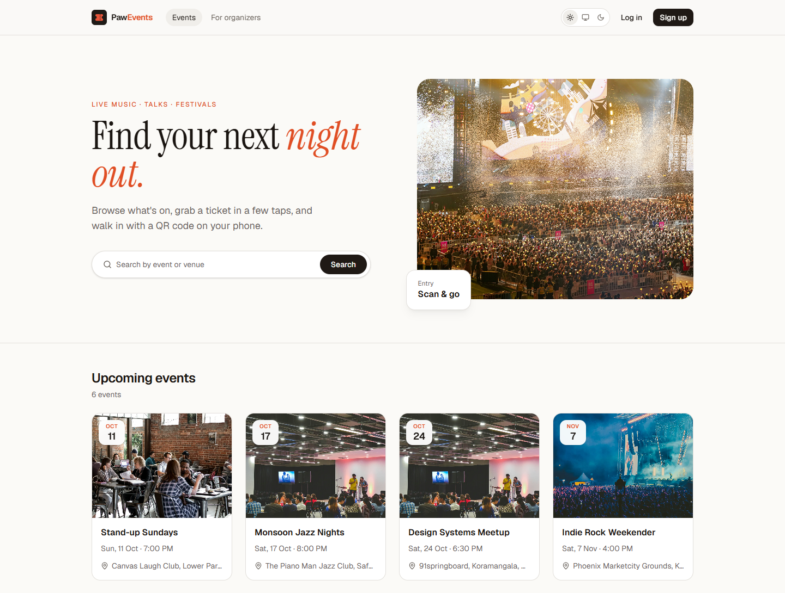
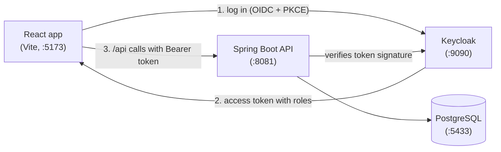
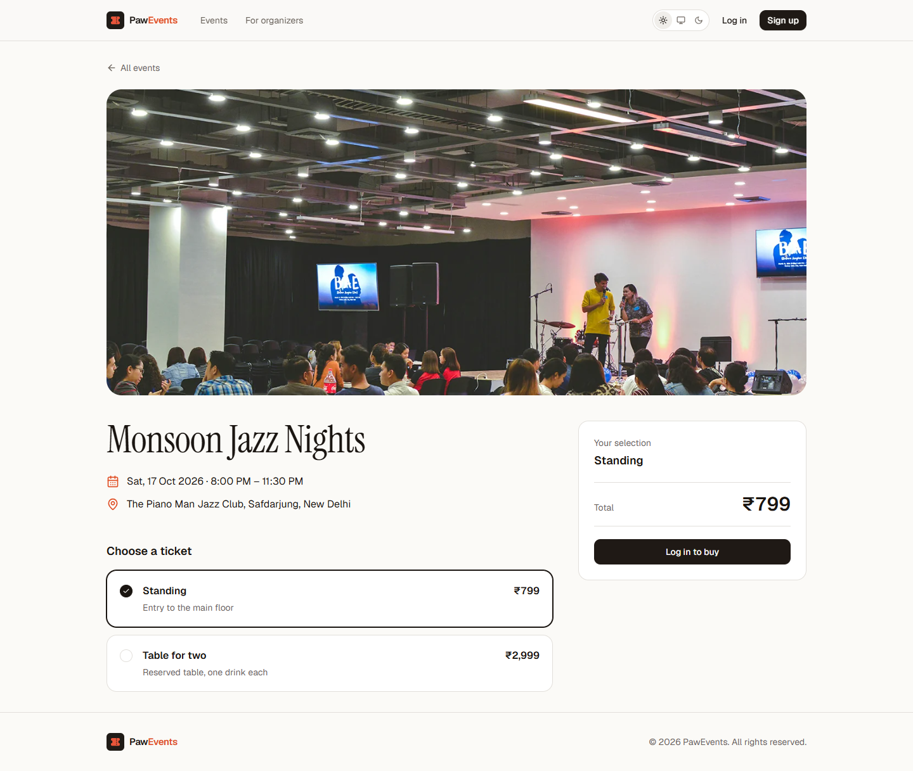
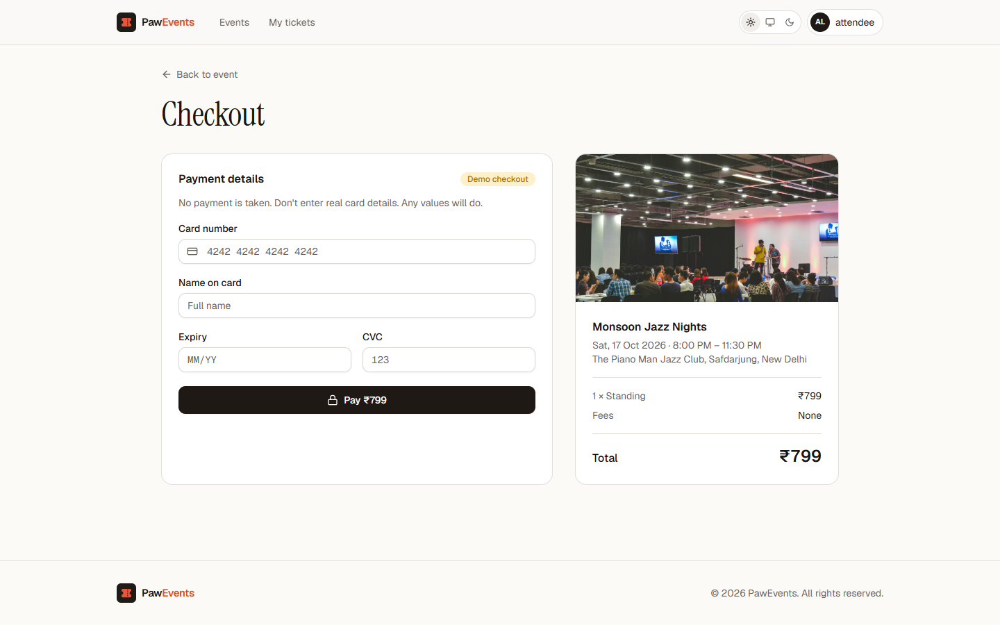
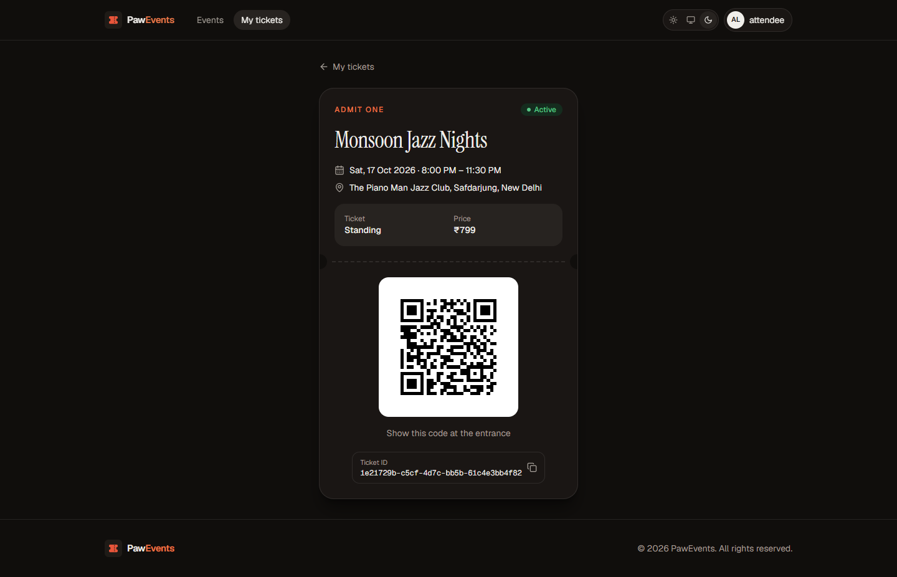
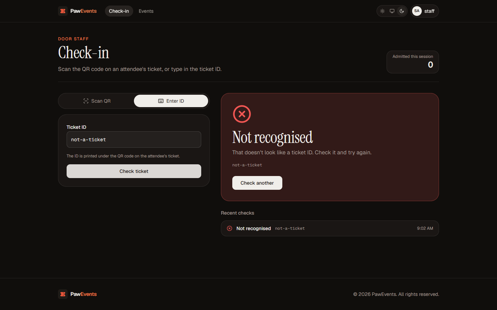
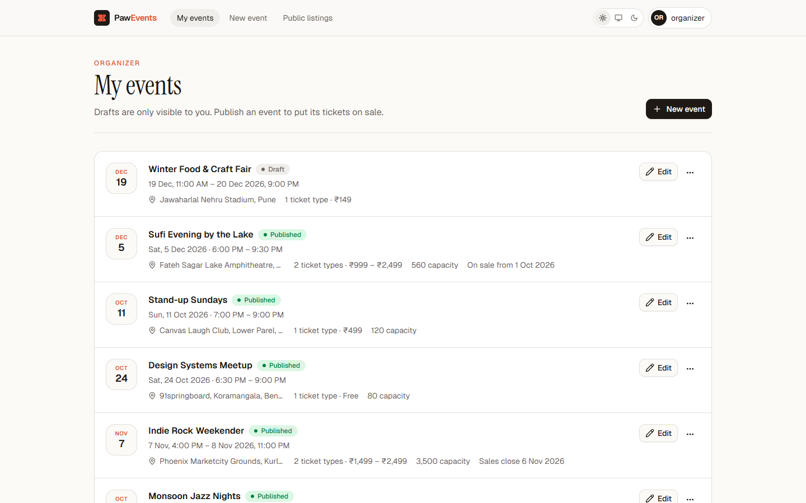
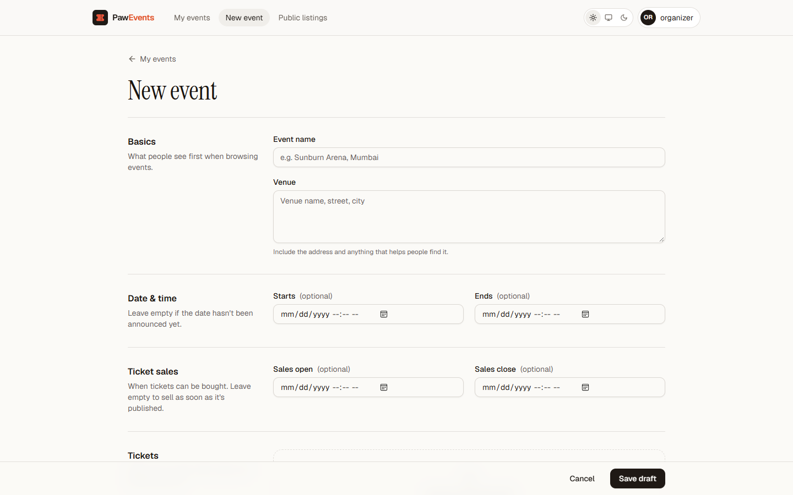
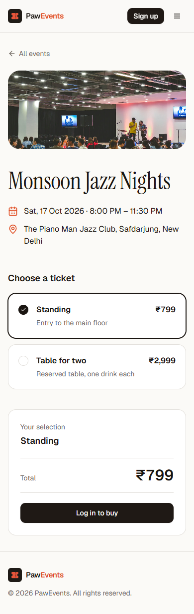

<div align="center">


# PawEvents

**Discover events, buy tickets, and check guests in with a QR code.**

A full-stack event ticketing platform with separate experiences for attendees, organizers and door staff.


<picture>
  <source media="(prefers-color-scheme: dark)" srcset="docs/screenshots/home-dark.png" />
  
</picture>

</div>

---

## Contents

- [What it does](#what-it-does)
- [Features](#features)
- [How it works](#how-it-works)
- [Tech stack](#tech-stack)
- [Getting started](#getting-started)
- [Demo accounts](#demo-accounts)
- [API](#api)
- [Screenshots](#screenshots)
- [Project structure](#project-structure)
- [Roadmap](#roadmap)

---

## What it does

PawEvents covers the whole life of an event ticket:

1. An **organizer** creates an event, adds ticket types (General, VIP…), sets when sales open and close, and publishes it.
2. An **attendee** finds the event, picks a ticket and checks out. Their ticket appears in *My tickets* with a unique QR code.
3. At the venue, **door staff** scan the QR code. A valid ticket is admitted once. Scanning it again is flagged as already used.

Each account type only sees the pages and actions it can use. Guests can browse everything that's on sale.

---

## Features

| | Guest | Attendee | Organizer | Door staff |
|---|:---:|:---:|:---:|:---:|
| Browse and search published events | ✓ | ✓ | ✓ | ✓ |
| Buy tickets |  | ✓ |  |  |
| View tickets with QR codes |  | ✓ |  |  |
| Create, edit, publish and delete events |  |  | ✓ |  |
| Manage ticket types, prices and capacity |  |  | ✓ |  |
| Check in tickets by QR scan or ticket ID |  |  |  | ✓ |

**Also included**

- Sign-in and self-registration through Keycloak (OpenID Connect with PKCE)
- Role checks enforced in both the API and the UI
- Sales windows: tickets can only be bought between the *sales open* and *sales close* times
- Capacity limits per ticket type, or unlimited
- Draft events stay private until published
- Double-entry protection: each ticket passes check-in once
- Light, dark and system themes
- Responsive layout for phones, tablets and desktops

---

## How it works



- **Keycloak** handles accounts and issues JWTs that carry the user's realm roles (`ROLE_ATTENDEE`, `ROLE_ORGANIZER`, `ROLE_STAFF`).
- **Spring Security** validates each token and maps those roles to route permissions. On a user's first request, a matching user record is created in the database.
- **Tickets** get a random UUID encoded as a QR code (generated with ZXing). Check-in looks the code up, records a validation, and reports whether the ticket was already used.

---

## Tech stack

| Layer | Technology |
|---|---|
| Frontend | React 19, TypeScript, Vite, Tailwind CSS 4, React Router 7, Radix UI, react-oidc-context |
| Backend | Java 21, Spring Boot 3.4, Spring Security (OAuth2 resource server), Spring Data JPA, MapStruct, Lombok |
| QR codes | ZXing (generation), `@yudiel/react-qr-scanner` (camera scanning) |
| Data | PostgreSQL 16 |
| Identity | Keycloak |
| Tooling | Docker Compose, Maven, ESLint, Prettier |

---

## Getting started

### Prerequisites

- [Docker Desktop](https://www.docker.com/products/docker-desktop/) (running)
- Java 21
- Node.js 22

### 1. Start the infrastructure

```bash
cd backend
docker compose up -d
```

This starts PostgreSQL, Adminer and Keycloak. On first start, Keycloak imports `backend/keycloak/event-ticket-platform-realm.json`, which sets up the realm, the frontend client, the three roles and the demo accounts.

### 2. Start the backend

```bash
cd backend
./mvnw spring-boot:run        # Windows: mvnw.cmd spring-boot:run
```

### 3. Start the frontend

```bash
cd frontend
npm install --legacy-peer-deps
npm run dev
```

Open **http://localhost:5173**.

### Ports

| Service | URL |
|---|---|
| Web app | http://localhost:5173 |
| API | http://localhost:8081 |
| Keycloak | http://localhost:9090 |
| Adminer (database UI) | http://localhost:8889 |
| PostgreSQL | `localhost:5433` |

---

## Demo accounts

| Username | Password | Role |
|---|---|---|
| `organizer` | `password` | Organizer: create and manage events |
| `attendee` | `password` | Attendee: buy tickets |
| `staff` | `password` | Door staff: check tickets in |

Keycloak admin console: `admin` / `admin`.

New sign-ups get the attendee role. To make someone an organizer or door staff member, assign the role in the Keycloak admin console under **Users → Role mapping**.

> These credentials are for local development only.

---

## API

All endpoints are under `/api/v1`. Everything except the published-events endpoints needs a Bearer token.

| Method | Endpoint | Role |
|---|---|---|
| `GET` | `/published-events?q=&page=&size=` | Public |
| `GET` | `/published-events/{id}` | Public |
| `POST` | `/events/{eventId}/ticket-types/{ticketTypeId}/tickets` | Attendee |
| `GET` | `/tickets` | Attendee |
| `GET` | `/tickets/{id}` | Attendee |
| `GET` | `/tickets/{id}/qr-codes` | Attendee |
| `GET` `POST` | `/events` | Organizer |
| `GET` `PUT` `DELETE` | `/events/{id}` | Organizer |
| `POST` | `/ticket-validations` | Door staff |

Errors are returned as `{ "error": "message" }`.

---

## Screenshots

<table>
  <tr>
    <td width="50%"><br /><sub><b>Event page.</b> Pick a ticket type and check out.</sub></td>
    <td width="50%"><br /><sub><b>Checkout.</b> Order summary and demo payment.</sub></td>
  </tr>
  <tr>
    <td><br /><sub><b>Ticket.</b> QR code shown at the entrance (dark theme).</sub></td>
    <td><br /><sub><b>Check-in.</b> Scan or type a ticket ID (dark theme).</sub></td>
  </tr>
  <tr>
    <td><br /><sub><b>My events.</b> Status, prices, capacity and sales windows.</sub></td>
    <td><br /><sub><b>New event.</b> Details, schedule, tickets and visibility.</sub></td>
  </tr>
</table>

<p align="center"><br /><sub>Mobile layout</sub></p>

---

## Project structure

```
PawEvents
├── backend
│   ├── keycloak/                  # realm export imported on first start
│   ├── src/main/java/com/pawevents/tickets
│   │   ├── config/                # security, JWT role mapping, QR writer
│   │   ├── controllers/           # REST endpoints + error handling
│   │   ├── domain/                # entities, DTOs, request objects
│   │   ├── filters/               # creates a user record on first login
│   │   ├── mappers/               # MapStruct DTO mappers
│   │   ├── repositories/          # Spring Data JPA
│   │   └── services/              # business rules (sales, capacity, check-in)
│   ├── docker-compose.yml
│   └── pom.xml
│
├── frontend
│   └── src
│       ├── components/            # layout, nav, cards, shared UI
│       ├── hooks/                 # roles and login helpers
│       ├── lib/                   # API client, formatting, theme
│       └── pages/                 # one file per route
│
└── docs/screenshots/
```

---

## Roadmap

- Payment gateway integration
- Email tickets and reminders
- Event categories and filters
- Sales analytics for organizers
- Assigning door staff to specific events
- Reviews and ratings

---

## Author

**Pawan Bhandari** · [@PawanBhandari03](https://github.com/PawanBhandari03)

## License

Released under the [MIT License](backend/LICENSE).
